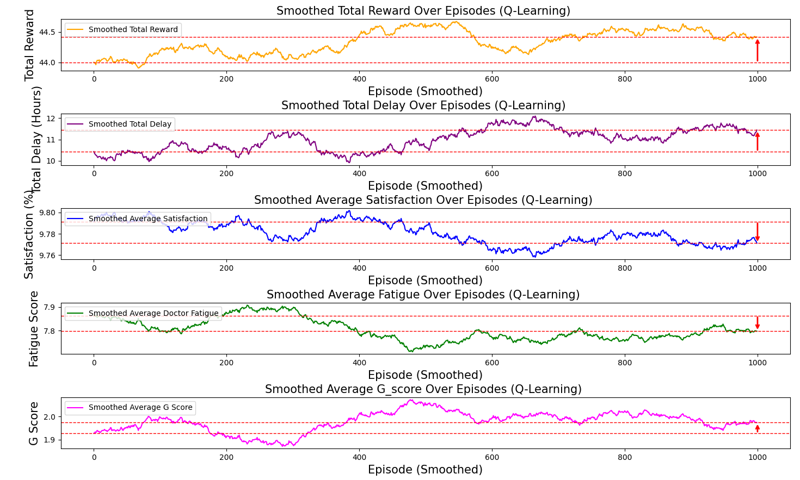

# Project Name

This project applies human-centered Q-Learning to surgical scheduling within a medical consortium, aiming to optimize resource allocation and improve efficiency while considering healthcare personnel well-being.

## Installation

You can either directly utilize our dataset located in the `dataset` folder. The data format is exemplified as follows:
```csv
| Patient ID | Day      | Start Time | End Time | Duration (hours) | Surgery Type                        | Emergency |
|--------------|----------|--------------|----------|------------------|-------------------------------------|-----------|
| 1            | Sunday   | 13:00        | 15:00    | 2                | Obstetrics and Gynecology Surgery   | No        |
| 2            | Monday   | 12:00        | 13:00    | 1                | Ophthalmic Surgery                  | No        |
| 3            | Friday   | 15:00        | 17:00    | 2                | Gastrointestinal Surgery            | No        |
| 4            | Sunday   | 14:00        | 15:00    | 1                | Obstetrics and Gynecology Surgery   | No        |
```
Alternatively, you can generate synthetic datasets using the script in ` dataset/generate_data.py`:
```bash
python dataset/generate_data.py
```
## Usage
To run the program, clone the repository and execute the main script:
```bash
git clone https://github.com/RDTAI/QHCMC.git
cd QHCMC
python main.py --num_hospitals 3 --num_patients 50 --method QL --a 1 --b 1
```
  
## Results Display

Upon successful execution, the program will display key results that demonstrate the performance of the scheduling algorithms:

- **Training Rewards and Scores**: Shows the evolution of rewards, patient satisfaction scores, healthcare worker fatigue scores, and G-scores over the training episodes. These metrics indicate how well the agent is learning to optimize the schedule.

- **Evaluation Metrics**: Summarizes the final evaluation results, including:
  - Average scheduling delay
  - Patient satisfaction level
  - Doctor fatigue level
  - Overall G-score (a composite measure of schedule quality)

- **Optimal Schedule**: Outputs the best schedule found by the algorithm, along with its G-score, demonstrating the effectiveness of the optimization.

If the results show decreasing delays, increasing satisfaction, and manageable fatigue scores, it indicates a successful run. Visualizations such as reward curves or metric trends may also be generated to help analyze the convergence and performance of the algorithms.

### Example of what you might see:


